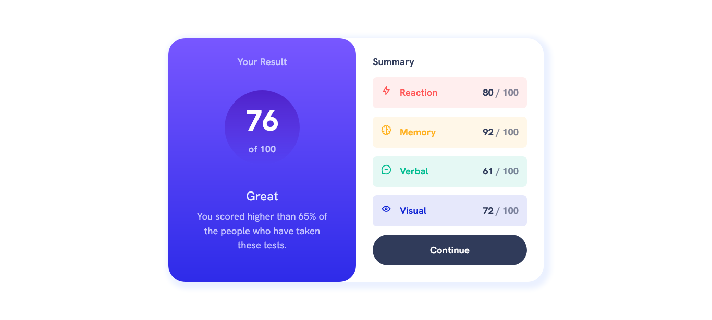

# Frontend Mentor - Results summary component solution

This is a solution to the [Results summary component challenge on Frontend Mentor](https://www.frontendmentor.io/challenges/results-summary-component-CE_K6s0maV). Frontend Mentor challenges help you improve your coding skills by building realistic projects. 

## Table of contents

- [Overview](#overview)
  - [The challenge](#the-challenge)
  - [Screenshot](#screenshot)
  - [Links](#links)
- [My process](#my-process)
  - [Built with](#built-with)
  - [What I learned](#what-i-learned)
  - [Continued development](#continued-development)
  - [Useful resources](#useful-resources)
- [Author](#author)

## Overview

### The challenge

Users should be able to:

- View the optimal layout for the interface depending on their device's screen size
- See hover and focus states for all interactive elements on the page
- **Bonus**: Use the local JSON data to dynamically populate the content

### Screenshot



### Links

- Solution URL: [](https://github.com/Fejiro001/results-summary-component)
- Live Site URL: [](https://fejiro001.github.io/results-summary-component/)

## My process

### Built with

- Semantic HTML5 markup
- CSS custom properties
- Flexbox
- CSS Grid
- Mobile-first workflow
- Sass

### What I learned

Learned and used Sass to design this project

```css
@mixin font-small($color: color, $weight: weight) {
    font-weight: $weight;
    font-size: $fs-small;
    color: $color;

    @media (min-width: $min-width) {
        font-size: calc($fs-small + .15rem);
    }
}

%flex-flow {
    display: flex;
    flex-direction: column;
}

%region {
    flex: 50%;
    display: grid;
    gap: $gap;
}
```

### Continued development

I am learning more on SASS, and will learn more about APIs.

### Useful resources

- [Learn Sass](https://sass-lang.com/guide/) - This gave me headstart into learning Sass.

## Author

- Frontend Mentor - [@Fejiro001](https://www.frontendmentor.io/profile/Fejiro001)
- Twitter - [@aberefejiro](https://twitter.com/aberefejiro)